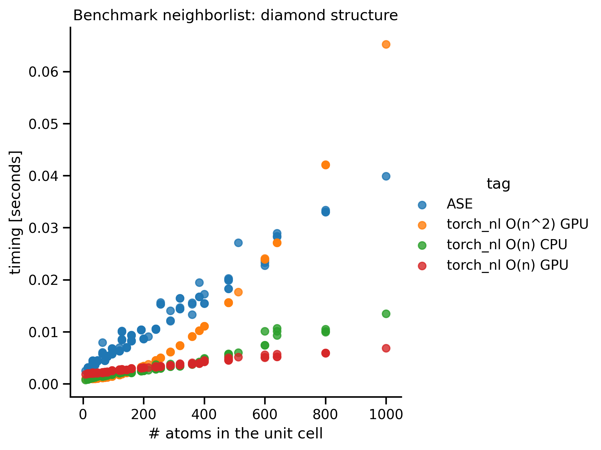

# torch_nl

Provide a pytorch implementation of a naive (`compute_neighborlist_n2`) and a linked cell (`compute_neighborlist`) neighbor list that are compatible with TorchScript.

Their correctness is tested against ASE's implementation.

# How to

## instal with pip

```bash
pip install torch-nl
```

## use the neighborlist

```python
from torch_nl import compute_neighborlist, ase2data
from ase.build import bulk, molecule

frames = [bulk("Si", "diamond", a=6, cubic=True), molecule("CH3CH2NH2")]
pos, cell, pbc, batch, n_atoms = ase2data(frames)

mapping, batch_mapping, shifts_idx = compute_neighborlist(
    cutoff, pos, cell, pbc, batch, self_interaction
)
```

# Benchmarks

## Periodic structure

